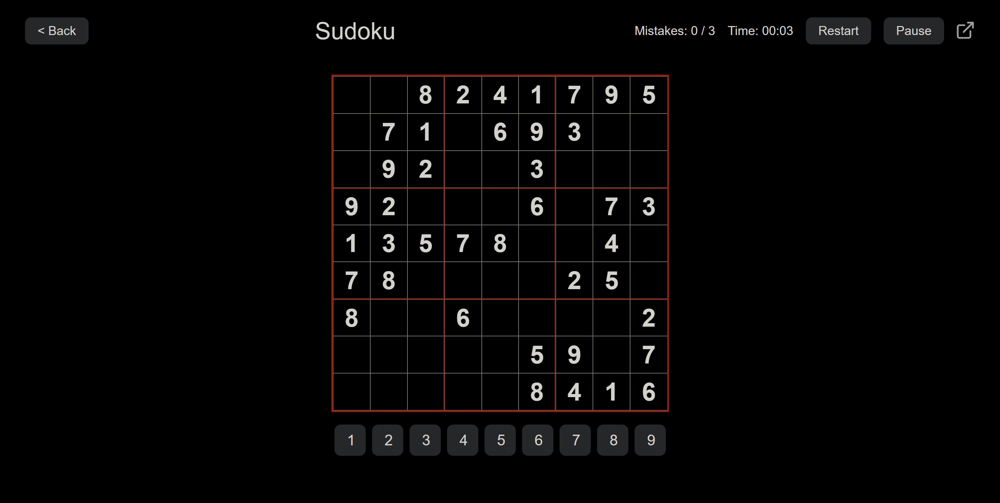

<h1>Sudoku</h1>
 

A sleek and responsive Sudoku game built with HTML, CSS, and vanilla JavaScript. Challenge yourself with procedurally generated puzzles across multiple difficulty levels in a modern, dark-themed interface.

 

<h2>Features</h2>
<h3>Difficulty Levels:</h3>
<ul>
<li><strong>Easy:</strong> A relaxed puzzle with more starting numbers to guide you.</li>
<li><strong>Medium:</strong> A balanced challenge for intermediate players.</li>
<li><strong>Hard:</strong> A tough puzzle with fewer clues to truly test your skills.</li>
</ul>
<h3>Gameplay Mechanics:</h3>
<ul>
<li><strong>Mistake Limit:</strong> The pressure is on! You only have three chances to make a mistake before the game is over.</li>
<li><strong>Smart Highlighting:</strong> Click a cell with a number to instantly highlight its corresponding row, column, box, and all other instances of that number.</li>
<li><strong>Instant Feedback:</strong> Correctly placed numbers turn cyan, while incorrect entries flash red and are immediately removed.</li>
<li><strong>Dynamic Number Pad:</strong> Numbers are automatically disabled on the pad once all nine have been placed correctly on the board.</li>
<li><strong>Game Timer:</strong> Track your speed with an integrated timer that includes a fully functional pause and resume feature.</li>
</ul>
<h3>Controls:</h3>
<ul>
<li><strong>Desktop:</strong> Use your mouse to click a cell and the on-screen number pad to input a value.</li>
<li><strong>Mobile:</strong> Tap a cell to select it and use the on-screen number pad to play.</li>
</ul>